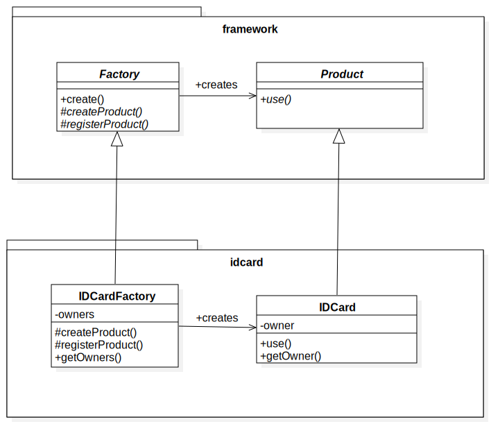

# Chapter3: Factory Method模式
## 1.[类图](../uml_model/FactoryMethod.mdj)

## 2.代码实现
+ [框架包(framework)](../src/cn/edu/seu/wh/factory/framework)
  + [*抽象工厂(生产者)类(Factory)*](../src/cn/edu/seu/wh/factory/framework/Factory.java)

  负责生成抽象产品类的抽象类，但具体的处理则交由子类。

  抽象生产者对具体的实例一无所知，**不用new来生成实例，而是通过生成实例的专用方法生成具体实例，这样可以防止抽象父类与其他具体类耦合.**

  + [*抽象产品类(Product)*](../src/cn/edu/seu/wh/factory/framework/Product.java)

  定义了在Factory Method模式中生成的那些实例所持有的接口(API)，但实际处理则交由子类具体的实例类处理。

+ [具体实例包(idcard)](../src/cn/edu/seu/wh/factory/idcard)
  + [具体工厂(生产者)类(IDCardFactory)](../src/cn/edu/seu/wh/factory/idcard/IDCardFactory.java)
  + [具体产品类(IDCardFactory)](../src/cn/edu/seu/wh/factory/idcard/IDCard.java)
+ [Main类](../src/cn/edu/seu/wh/factory/Main.java)

### 拓展：生成实例--方法的三种实现方式

*Factory类*中的*createProduct*为抽象方法，也就是必须子类来实现该方法。有三种方式实现之。

#### 1.指定其为抽象方法

子类就必须实现该方法。

#### 2.为其实现默认处理

这样子类如果没有实现该方法，将进行默认处理。

```java
abstract class Factory{
  public Product createProduct(String name){
    return new Product(name);
    ...
  }
}
```

由于用new生成了创建实例，这样Product就不能是抽象类。

#### 3.在其中抛出异常

在默认方法处理为抛出异常，如果子类没有实现该方法，则抛出异常。

```java
class Factory{
  public Product createProduct(String name){
    throw new FactoryMethodRuntimeException();
    ...
  }
}
```

但这需要另外编写FactoryMethodRuntimeException异常类。

### 问答：
#### 1.为什么IDCard类的构造器函数没有声明成public，而是如下？
```java
IDCard(String owner) {
        System.out.println("正在制作："+owner+"的IDCard!");
        this.owner = owner;
}
```
a: 这是想让在idcrad包外无法new出IDCard实例，强迫其他包的类通过IDCardFactory生成IDCard。
#### 2.为了强制向Product子类构造器传入参数，实现对Product，采用如下定义会出错，为什么？
```java
public abstract class Product {
    public abstract Product(String name);
    public abstract void use();
}
```
a: 1.Java中构造函数是不能被继承的；2.Java中无法定义abstract类的构造函数。

要实现上述需求，可以通过定义设置name的方法
```java
public abstract class Product {
    public abstract void setName(String name);
    public abstract void use();
}
```